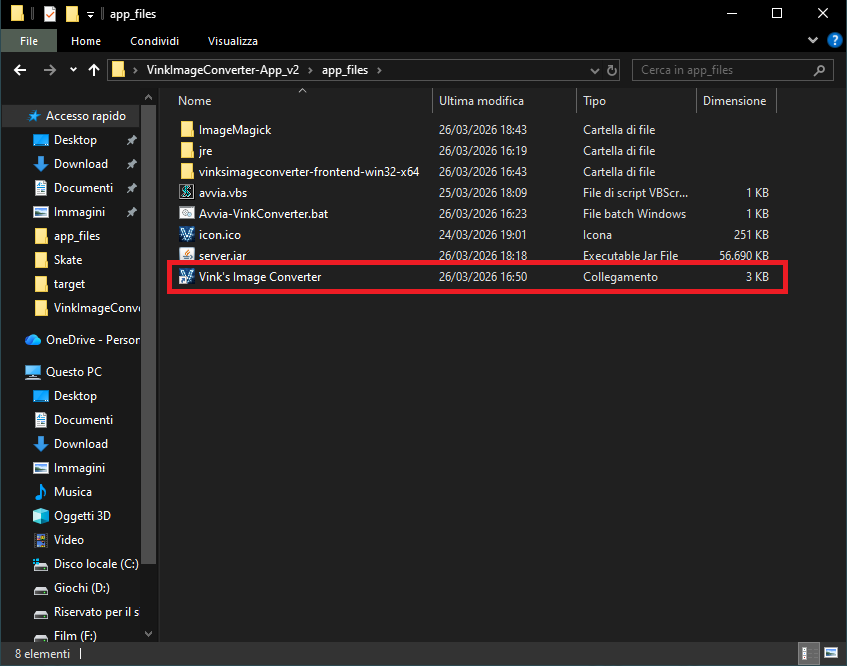
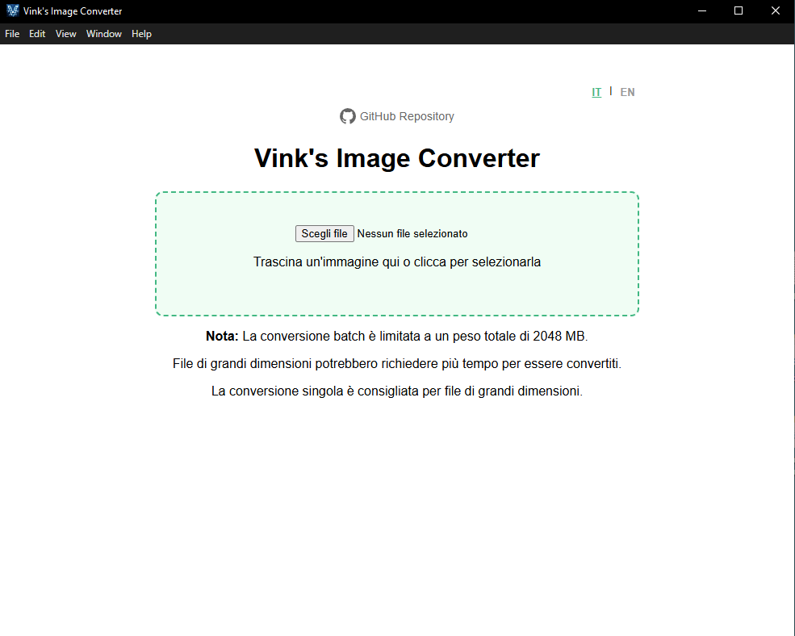
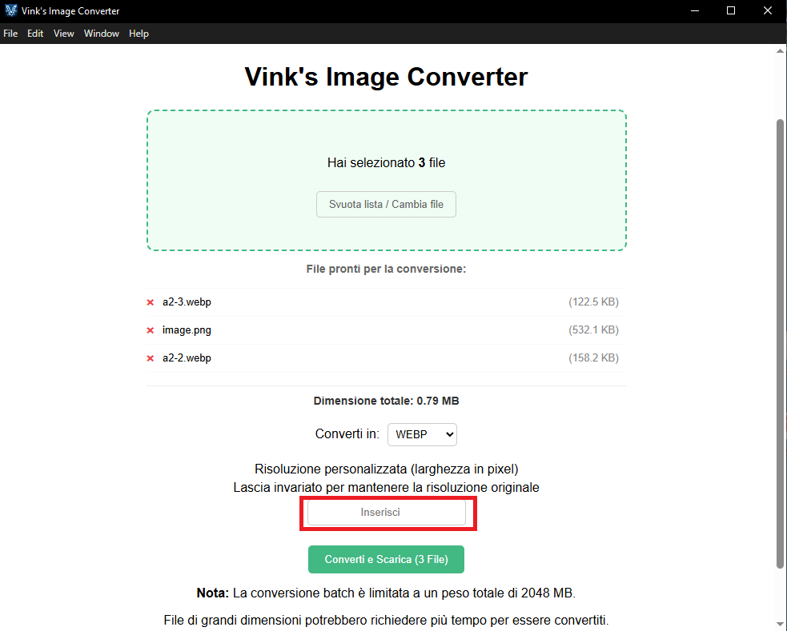
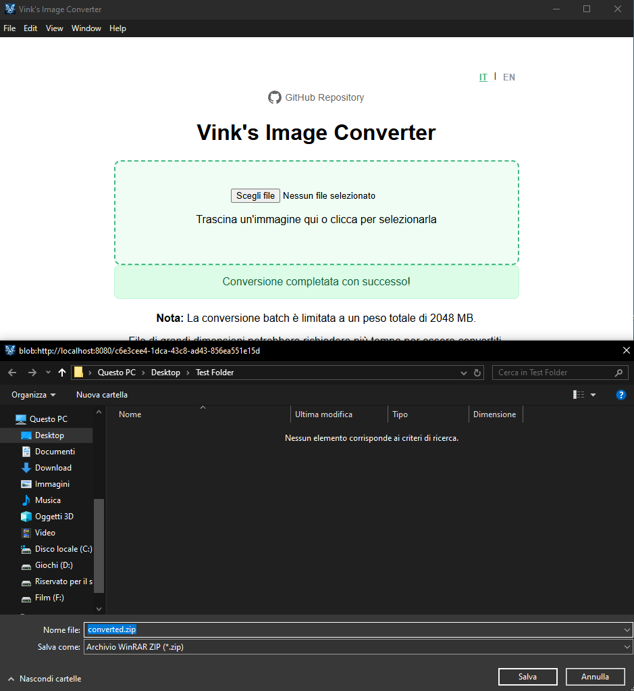

# Vink's Image Converter
[English](README.md)

Vink's Image Converter è un convertitore di immagini gratuito. Attualmente supporta al 100% i seguenti formati:
* .webp
* .avif
* .png
* .jpg
* .ico

> [!NOTE]
> La velocità di conversione è influenzata esclusivamente dalla RAM del computer che esegue l'operazione.
>
> Miglioramenti grafici arriveranno nelle versioni future.
>
> Il motivo alla base di questo progetto è che volevo testare le mie capacità e creare qualcosa che userei davvero nelle mie attività quotidiane.
>
> Dai un'occhiata alle release recenti [**qui**](https://github.com/vinkstandard/Vinks-Image-Converter/releases)

> [!CAUTION]
> Il programma è funzionante per sistemi operativi Windows 64bit, non ho testato su altri sistemi.
> 
> I formati di stampa come .pdf, .tiff e .bmp sono instabili e sto lavorando per migliorarne il supporto.
>
> Sebbene il programma supporti senza problemi la conversione multipla, per i file di grandi dimensioni è consigliato eseguire la conversione un file alla volta,
> a meno che non si possieda un PC della NASA.
>
> Convertire un'immagine con sfondo trasparente in .JPG comporterà la perdita della trasparenza.
>
> È consigliato, nel caso si voglia effettuare una conversione in .ICO, avere l'immagine originale quadrata, altrimenti risulterà deformata.
>
> Durante il downscaling, il programma rispetta i limiti dei formati. Se si tenta di ridimensionare un'immagine a una risoluzione troppo alta per quel formato, il programma imposterà automaticamente
> l'immagine alla risoluzione massima consentita dal formato scelto.

## Come usare il programma

### 1. Vai su [**release**](https://github.com/vinkstandard/Vinks-Image-Converter/releases) e scarica la versione più recente.

### 2. Estrai il contenuto del file .rar. Una volta estratto, dovresti avere davanti a te una cartella chiamata "VinkImageConverter-App".

### 3. Apri il programma avviando il collegamento "Vink's Image Converter".

### 4. Il programma si aprirà e ti ritroverai davanti a questa schermata.

### 5. Inserisci una o più immagini e seleziona un formato per la conversione. Se desideri effettuare il downscaling (ridurre la risoluzione dell'immagine), inserisci un valore in pixel nel riquadro evidenziato; altrimenti, lascialo vuoto.

### 6. Una volta cliccato il pulsante "Converti e Scarica", ti verrà chiesto dove vuoi salvare il file .zip contenente le immagini convertite.

