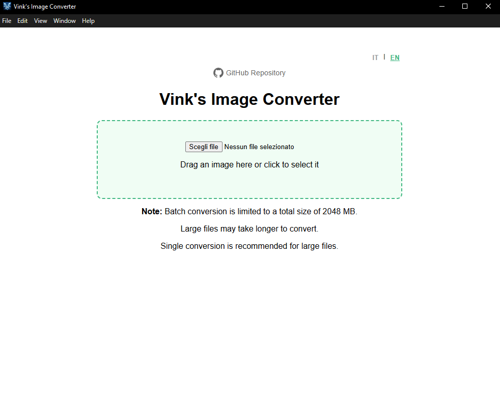
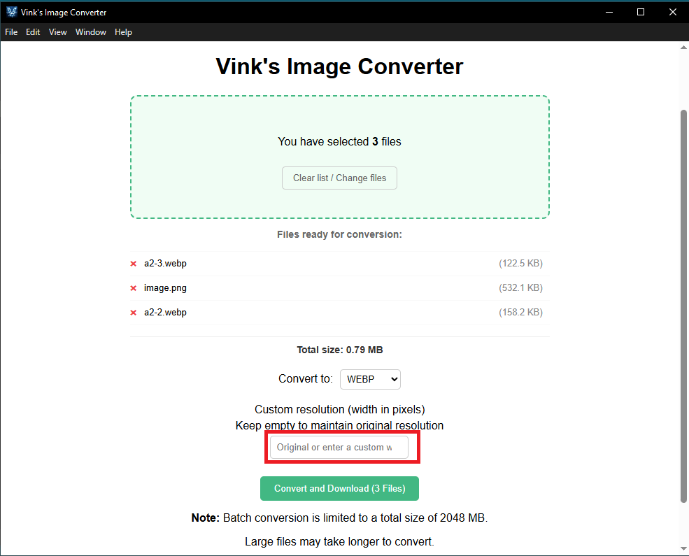
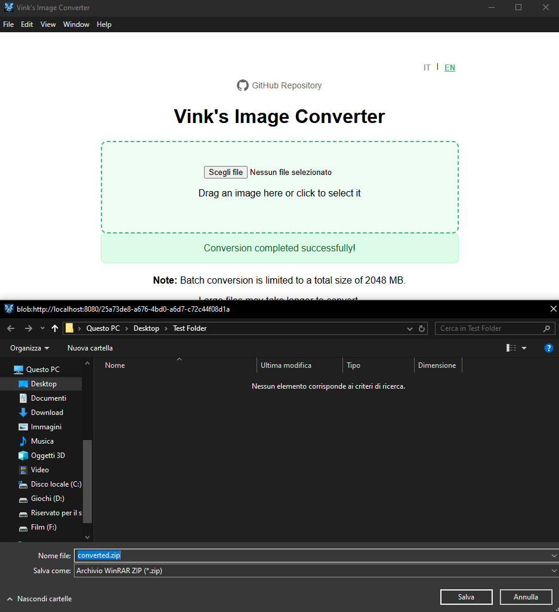

# Vink's Image Converter
[Italiano](README.it.md)

Vink's Image Converter is a free image converter. It currently supports the following formats 100%:
* .webp
* .avif
* .png
* .jpg
* .ico

> [!NOTE]
> Conversion speed is influenced exclusively by the RAM of the computer performing the operation.
>
> Graphical improvements will be introduced in future versions.
>
> The idea behind this project was to test my skills and build something I would actually use in my daily activities.
>
> Check out the latest releases [**here**](https://github.com/vinkstandard/Vinks-Image-Converter/releases)

> [!CAUTION]
> Print formats such as .pdf, .tiff, and .bmp are currently unstable, and I am working on improving their support.
>
> It is recommended to open the program only through
>
> Although the program fully supports batch conversion, for large files it is recommended to process one file at a time,
> unless you own a NASA-level PC.
>
> Converting an image with a transparent background to .JPG will result in the loss of transparency.
>
> When converting to .ICO, it is recommended to use a square image; otherwise, the result may appear stretched.
>
> During downscaling, the program respects format limitations. If you attempt to resize an image to a resolution that is too high for the selected format, the program will automatically
> set the image to the maximum supported resolution for that format.
>
> For the application to function properly, it must be launched exclusively using the "Vink's Image Converter" shortcut.
>
> Do not move or modify any files inside the "app_files" folder, as this may cause the application to malfunction.

## How to use the program

### 1. Go to the [**releases**](https://github.com/vinkstandard/Vinks-Image-Converter/releases) page and download the latest version.

### 2. Extract the contents of the .rar file. Once extracted, you should see a folder named "VinkImageConverter-App".

### 3. Launch the program by opening the "Vink's Image Converter" shortcut.

### 4. The program will open, and you will see this screen.

### 5. Add one or more images and select a format for conversion. If you want to perform downscaling (reduce the image resolution), enter a value in pixels in the highlighted field; otherwise, leave it empty.

### 6. After clicking the "Convert and Download" button, you will be prompted to choose where to save the .zip file containing the converted images.

